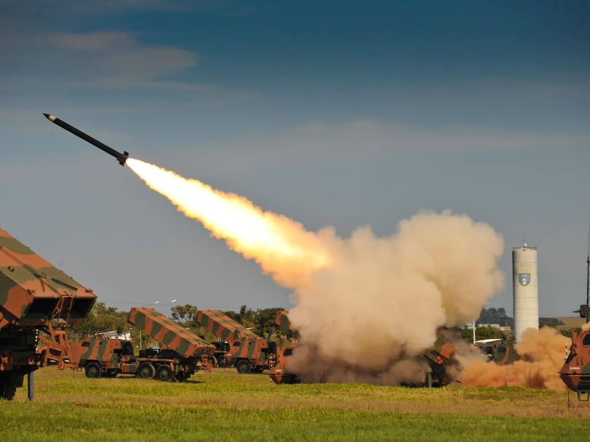
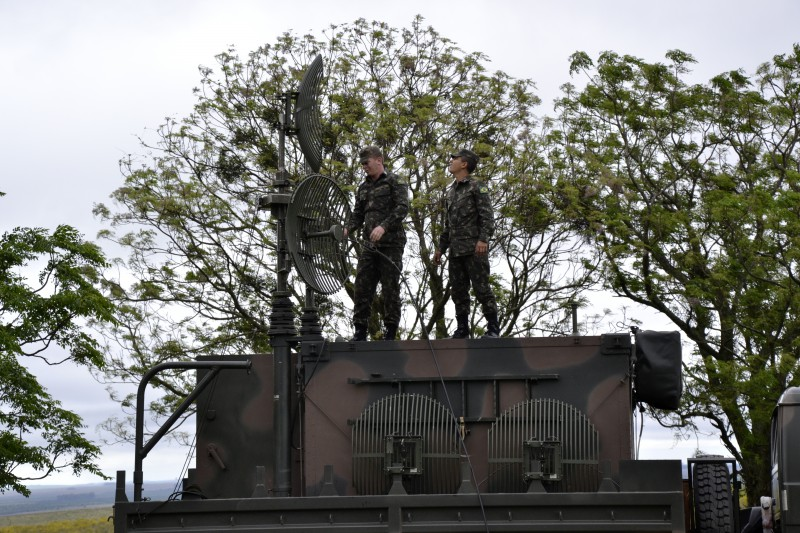

# Operação Cripto-Sentinela

**Situação:** Você faz parte do Comando de Defesa Cibernética (CDCiber) e está encarregado de proteger o **SISDEF (Sistema Integrado de Defesa de Fronteiras)**. Uma entidade hostil desconhecida, codinome **"Sombra"**, conseguiu acesso de leitura ao nosso **Canal de Comando Unificado (CCU)**, uma rede de comunicação baseada em [MQTT](./mqtt.md) usada para coordenar todas as unidades táticas (UTs) do país: caças Gripen, submarinos da classe Riachuelo e baterias de mísseis.

<p align="center">
  
  
  
</p>

O "Sombra" pode ler todas as mensagens trocadas, o Sombra ainda não e capaz de transmitir novo dados, mas ele consegue alterar menssagens transmitidas no canal. Ou seja, ele pode forjar um ordem de ataque.

<!-- Sua missão é garantir que ele não possa alterar ordens sem ser detectado e criar  -->

**Sua Missão:** Implementar um protocolo de comunicação seguro que permita às Unidades Táticas (grupos de alunos) trocarem ordens de combate (vetores de ataque, posições, etc.) através do CCU público, garantindo:

1.  **Confidencialidade:** A "Sombra" não pode ler o conteúdo das ordens.
2.  **Integridade:** Qualquer alteração em uma ordem durante o trânsito deve ser imediatamente detectada.
3.  **Autenticidade:** Cada unidade deve ter 100% de certeza da identidade do remetente.
4.  **Não-Repúdio:** Uma unidade não pode negar ter enviado uma ordem.
5.  **Controle de Acesso Dinâmico:** Unidades podem ser adicionadas ou removidas da rede de confiança em tempo real caso sejam comprometidas.


<p align="center">
  
  
</p>

**ToC**:
1. [Unidades Táticas](#-as-unidades-táticas)
1. [Arquitetura do Sistema](#arquitetura-do-sistema)
1. [Funcionalidades do Sistema](#funcionalidades-do-sistema)
1. [Dicas](#dicas-de-implementação)
1. [Ambiente de Testes](#-o-oráculo-está-no-ar)

## 🪖 As Unidades Táticas 

 **Formação das Unidades Táticas**: Cada aluno deverá selecionar **uma única unidade tática** entre as disponíveis abaixo, garantindo que **não haja duplicidade de escolha entre os colegas**:

| Codinome   | Chave RSA                 | Chave ECDSA               |
|:----------:|:--------------------------|:--------------------------|
| `oraculo` 👀  | [🔑$_{rsa}$](#chaves-públicas-do-oraculo) |   [🔑$_{ecdsa}$](#chaves-públicas-do-oraculo)         |
| `UT-Alfa`     | compartilhada no tópico   | compartilhada no tópico   |
| `UT-Bravo`    | compartilhada no tópico   | compartilhada no tópico   |
| `UT-Charlie`  | compartilhada no tópico   | compartilhada no tópico   |
| `UT-Delta`    | compartilhada no tópico   | compartilhada no tópico   |
| `UT-Echo`     | compartilhada no tópico   | compartilhada no tópico   |
| `UT-Foxtrot`  | compartilhada no tópico   | compartilhada no tópico   |
| `UT-Golf`     | compartilhada no tópico   | compartilhada no tópico   |
| `UT-Hotel`    | compartilhada no tópico   | compartilhada no tópico   |
| `UT-Zulu`     | compartilhada no tópico   | compartilhada no tópico |

⚠️ Os codinomes **`oraculo` 👀** e **`sombra`** serão operados exclusivamente pelo **professor**, como papéis estratégicos ou supervisores durante as atividades.


### Chaves Públicas do Oraculo

#### 🔑$_{rsa}$  

> MIIBIjANBgkqhkiG9w0BAQEFAAOCAQ8AMIIBCgKCAQEA0JYEsxupPYOio+u8xHdzSNLQgQoPwFx/qceHQJPy2KzNSCXz3FFyKkXaso4UTorzy8XXDv5WkRC1AlDDVu28ANXlrZqLyjLZ8DdplHig2KSxYV5MXA5TyqMDeCAW5CWi+na5Xwr9IbtuTfCv65YeB3QRgZWjZ4oVxpGVek+4dec0qChNl6pL9KmgI4u5CHHC8d7z6MovK0+eN0aMIT2bWgri29tT9sDCoHEGaab1576+SXK3iDXlLkeehJ/h72lqu3HmSL/B5ZE+pKLVLJogSwwMCTejrfTXf5acj9EOq83wGNLTjHIKr2iMz+SZzFS4vxk6qMgltCXjBZfXalzLnwIDAQAB

#### 🔑$_{ecdsa}$

> MFkwEwYHKoZIzj0CAQYIKoZIzj0DAQcDQgAEfmgdDET1IKOR2OxLI9KBBzFB97GyrJKipAuwSrMhDn1w93ieoCb7etbYX5/wrUic9xX5LQbUdgyKSRuCnTPAeQ==

## Arquitetura do Sistema


O sistema consiste em:

*   **Canal de Comando Unificado (CCU):** Usaremos o Broker MQTT público `test.mosquitto.org`. Todo o tráfego é público.
    *   Para uma explicação de como funciona o MQTT consulte o [link](./mqtt.md).
*   **Unidades Táticas (UTs):** Cada grupo de alunos operará como uma UT e terá um identificador único (ex: `UT-Alfa`, `UT-Bravo`, ...)
    *   O codinome de cada equipe é secreto é sera enviado por e-mail
*   **Tópicos MQTT Padronizados:**
    *   **Publicação de Chaves (IFF):** `sisdef/broadcast/chaves/<id_unidade>`
        *   Cada UT publica suas chaves públicas aqui para que outras possam encontrá-las.
    *   **Envio de Ordens Diretas:** `sisdef/direto/<id_unidade_destino>`
        *   Mensagens seguras são enviadas para este tópico.
    *   **Revogação de Acesso:** `sisdef/broadcast/revogacao`
        *   Notificações sobre unidades comprometidas são publicadas aqui.

### Detalhes de implementação da Criptografia Assimétrica

As Unidades Táticas (UTs) e o **Oráculo** utilizarão chaves **RSA** e **ECDSA** para garantir a segurança do canal CCU. A implementação usará a biblioteca:

```python
from cryptography.hazmat.primitives.asymmetric
```

### 📦 Formato de transmissão das chaves

Todas as chaves devem ser enviadas e recebidas **em formato Base64**. Isso garante compatibilidade com os meios de comunicação MQTT e facilita o armazenamento e compartilhamento seguro.


#### 🔄 Conversão de Chaves Públicas em Base64 para Objetos Python

```python
import base64
from cryptography.hazmat.primitives import serialization

def load_rsa_pub_key(b64_str):
    key_bytes = base64.b64decode(b64_str)
    return serialization.load_der_public_key(key_bytes)

def load_ecdsa_pub_key(b64_str):
    key_bytes = base64.b64decode(b64_str)
    return serialization.load_der_public_key(key_bytes)
```


#### 💾 Exportação de Chaves Assimétricas 

Para que as UT possam compartilhar suas chaves públicas com segurança e interoperabilidade no **Canal de Comando Unificado (CCU)**, todas as chaves devem ser codificadas em **Base64**, utilizando os padrões:

- **Codificação:** `DER` (Distinguished Encoding Rules)  
- **Formato de Chave Privada:** `PKCS8`  
<!-- - **Formato de Chave Pública:** `SubjectPublicKeyInfo` -->

Abaixo segue um exemplo de função em Python para exportar as chaves RSA ou ECDSA em uma estrutura serializada JSON, pronta para transmissão segura via MQTT:

```python
import base64
from cryptography.hazmat.primitives import serialization

def export_keys_as_string(private_key, public_key):
    _priv_bytes = private_key.private_bytes(
        encoding=serialization.Encoding.DER,
        format=serialization.PrivateFormat.PKCS8,
        encryption_algorithm=serialization.NoEncryption()
    )
    _pub_bytes = public_key.public_bytes(
        encoding=serialization.Encoding.DER,
        format=serialization.PublicFormat.SubjectPublicKeyInfo
    )

    chaves = {
        "private_key": base64.b64encode(_priv_bytes).decode(),
        "public_key": base64.b64encode(_pub_bytes).decode()
    }

    return chaves
```

> 💡 Essa função pode ser usada tanto para RSA quanto para ECDSA — basta passar a instância da chave correspondente. 


## Funcionalidades do Sistema

Leia atentamente as instruções

### Estabelecimento da Identidade (IFF - Identification Friend or Foe)

Antes de poder se comunicar, cada UT deve gerar sua identidade criptográfica.

1. 🔑 **Gere seu Par de Chaves Assimétricas**: Cada UT deve gerar **dois** pares de chaves:
    *   **Chave de Criptografia (RSA):**
        *   **Algoritmo:** RSA
        *   **Tamanho:** 2048 bits
        *   **Expoente Público:** 65537
        *   **Uso:** Para que outras unidades possam enviar dados confidenciais (como chaves de sessão) **para você**. A sua chave pública RSA será usada por outros para criptografar. Sua chave privada será usada por você para decriptografar.
        <!-- *   **Padding:** Use **OAEP**, que é o padrão seguro. -->
    *   **Chave de Assinatura (ECDSA/EdDSA):**
        *   **Algoritmo:** **EdDSA** (usando a curva **secp256r1**) – Curva ECDSA disponivel no python.
        *   **Uso:** Para ASSINAR as ordens que você envia, provando que vieram de você. Sua chave privada assina, sua chave pública verifica.

2. 📰 **Publicação da Identidade no CCU:** Todas as **chaves públicas** (RSA e EdDSA) devem ser codificadas em **Base64** antes da publicação, vide a [seção](#-formato-de-transmissão-das-chaves). As chaves codificadas poderão ser decodificadas pelas UTs receptoras utilizando a função `base64.b64decode()` ou via os carregadores de chave já descritos anteriormente.
    *   Crie um objeto JSON contendo suas **chaves públicas** (ambas, RSA e EdDSA). As chaves devem ser formatadas como strings (geralmente em formato PEM).
        - O identificador da sua unidade.
        - A chave pública RSA (como string).
        - A chave pública EdDSA (como string).
    *   Publique este JSON como uma string no tópico MQTT: `sisdef/broadcast/chaves/<seu_id_de_unidade>`.
        * Observação: o `<seu_id_de_unidade>` deve estar **todo em minúsculas**.
            * `sisdef/broadcast/chaves/ut-zuli`

    **Exemplo do JSON a ser publicado:**
    ```json
    {
      "id_unidade": "ut-alfa",
      "chave_publica_rsa": "MIIC...IDAQAB",
      "chave_publica_eddsa": "MCowB...3N2ZQ="
    }
    ```
Essas chaves poderão ser lidas e reconstruídas pelas demais UTs utilizando os métodos `load_der_public_key()` com os bytes decodificados de base64.

### Envio de menssagens e ordens de combate sigilosas / Formato de Mensagem Segura

Uma Unidade Tática precisa enviar uma ordem para outra unidade através do CCU comprometido. A ordem pode ser um texto simples (`"Mover para coordenada X,Y"`) ou um dado complexo, como uma imagem de satélite (representada como uma string Base64).

**Objetivo:** garantir Confidencialidade, Integridade, Autenticidade e Não-Repúdio na entrega de `{payload}` via MQTT. Cada mensagem enviada deve seguir o formato JSON abaixo, onde todos os campos são codificados em Base64:

```json
{
  "ciphertext_b64": "...",
  "tag_autenticacao_b64": "...", 
  "nonce_b64": "...",
  "chave_sessao_cifrada_b64": "...",
  "assinatura_b64": "..."
}
```

Componentes da crypto-msg

**1. Integridade (Hashing)**
- Calcule o hash SHA-256 da mensagem original
- Este hash será usado para verificar se a mensagem não foi alterada

**2. Confidencialidade (Criptografia Simétrica)**
- Gere uma chave de sessão aleatória de 256 bits para AES
- Criptografe a mensagem usando AES-256 no modo GCM, que produz:
  - `ciphertext_b64`: O texto cifrado da mensagem
  - `tag_autenticacao_b64`: Tag que garante integridade do texto cifrado
  - `nonce_b64`: Número único usado na criptografia

**3. Compartilhamento Seguro da Chave (Criptografia Assimétrica)**
- `chave_sessao_cifrada_b64`: A chave de sessão AES criptografada com a chave pública RSA do destinatário

**4. Autenticidade (Assinatura Digital)**
- `assinatura_b64`: Assinatura do hash SHA-256 da mensagem original usando a chave privada ECDSA do remetente

#### Exemplo de Uso

Para enviar uma ordem para `UT-Bravo`, o pacote deve ser publicado no tópico MQTT:

```
sisdef/direto/ut-bravo
```

**Exemplo de mensagem original:**
```
"Atacar Sombra nas coordenadas: 22°54'S 43°10'W"
```

**Pacote final transmitido:**
```json
{
  "remetente" : "UT-Bravo",
  "ciphertext_b64": "kQwE7X9mNpY8...",
  "tag_autenticacao_b64": "mF3K8pL2nR...",
  "nonce_b64": "nR8kL3mP9qX...",
  "chave_sessao_cifrada_b64": "sL7nM2kR8wE...",
  "assinatura_b64": "qM8nL3kR7wP..."
}
```


   | Campo                       | Descrição                                         |
   |-----------------------------|---------------------------------------------------|
   | `remetente`            | String(ciphertext)                                |
   | `ciphertext_b64`            | Base64(ciphertext)                                |
   | `tag_autenticacao_b64`                   | Base64(tag)                                       |
   | `nonce_b64`                 | Base64(nonce)                                     |
   | `chave_sessao_cifrada_b64`          | Base64(enc_key)                                   |
   | `assinatura_b64`             | Base64(signature)                                 |

> **Lembrete:** Todos os dados devem ser codificados em Base64 para garantir transmissão segura via MQTT como texto simples.


<!-- ### **Fase 3: Recebimento e Validação da Ordem** -->

### Processo de Descriptografia e Validação

O receptor deve estar inscrito no tópico correspondente (`sisdef/direto/<seu_id>`) para receber mensagens direcionadas. **A ordem de verificação é CRÍTICA** - todos os passos devem ser executados sequencialmente para garantir a segurança completa.

#### Exemplo: UT-Bravo Recebendo uma Mensagem

A `UT-Bravo` está inscrita no tópico `sisdef/direto/UT-Bravo` e recebe um pacote seguro. O processo de validação deve seguir rigorosamente esta sequência:

#### Passos para Descriptografia e Validação

**1. Recepção e Desestruturação do Pacote**
- Leia a mensagem JSON do tópico MQTT
- Converta a string JSON de volta para um objeto
- Decodifique todos os campos Base64 para seus formatos binários originais

**2. Recuperação da Chave de Sessão**
- Use sua **chave privada RSA** para descriptografar o campo `chave_sessao_cifrada_b64`
- **Ponto de falha:** Se a descriptografia falhar, a mensagem não era destinada a você ou foi corrompida

**3. Descriptografia da Mensagem**
- Use a chave de sessão AES recuperada junto com `nonce_b64` e `tag_autenticacao_b64`
- Descriptografe o `ciphertext_b64` usando AES-256-GCM
- **Verificação automática de integridade:** Se a tag não corresponder ao ciphertext (indicando alteração pela "Sombra"), a biblioteca retornará erro.

**4. Validação de Autenticidade e Não-Repúdio**
- Obtenha a **chave pública ECDSA** do remetente dispnobilizada CCU ([IFF](#estabelecimento-da-identidade-iff---identification-friend-or-foe))
- Calcule o hash **SHA-256** da mensagem descriptografada
- Use a chave pública ECDSA do remetente para verificar se a `assinatura_b64` corresponde ao hash calculado
- **Prova criptográfica:** Se a verificação for bem-sucedida, você tem garantia matemática de que:
  - A mensagem veio do remetente alegado
  - A mensagem não foi alterada em trânsito
  - O remetente não pode negar ter enviado a mensagem

#### Resultado da Validação

**✅ Sucesso:** Se todos os passos forem bem-sucedidos, a ordem é autêntica, íntegra e pode ser executada com segurança.

**❌ Falha:** Se qualquer passo falhar, a mensagem deve ser **rejeitada imediatamente** e o incidente reportado como possível atividade da "Sombra". Envie uma messagem (criptografada) para o oraculo informando o erro.

> **Importante:** O receptor deve validar **todos** os aspectos de segurança antes de considerar a mensagem como confiável. Pular qualquer etapa compromete a segurança de toda a operação.


### Revogação de Acesso (Unidade Comprometida)

**Cenario** : O Oraculo identifica que uma unidade foi comprometida pela "Sombra" e seu acesso deve ser revogado imediatamente de toda a rede de comunicação segura.

#### Processo de Revogação

**1. Emissão da Ordem de Revogação**

Qualquer Unidade Tática confiável pode emitir uma ordem de revogação seguindo este processo:

- Crie uma mensagem de revogação em formato JSON contendo:
  - `unidade_revogada`: Identificador da unidade comprometida
  - `timestamp`: Data e hora da revogação em formato ISO 8601
- **Assine digitalmente** o hash SHA-256 desta mensagem JSON usando sua chave privada ECDSA
- Monte o pacote final de revogação

**Exemplo de mensagem de revogação:**
```json
{
  "unidade_revogada": "ut-charlie",
  "timestamp": "2023-10-27T10:00:00Z"
}
```

**2. Publicação da Revogação**

O pacote de revogação deve ser publicado no tópico de broadcast:
```
sisdef/broadcast/revogacao
```

**Formato do pacote de revogação:**
```json
{
  "remetente": "ut-alfa",
  "revogacao": {
    "unidade_revogada": "ut-charlie", 
    "timestamp": "2023-10-27T10:00:00Z"
  },
  "assinatura_b64": "mK8nP3kR7wL..."
}
```

#### Processamento de Revogações pelas UTs Receptoras

**3. Validação e Aplicação da Revogação**

Todas as Unidades Táticas devem:

- **Inscrever-se** no tópico `sisdef/broadcast/revogacao` para receber notificações
- **Validar a autenticidade** de cada ordem de revogação recebida:
  - Obter a chave pública ECDSA do remetente
  - Calcular o hash SHA-256 da mensagem de revogação
  - Verificar a assinatura digital para confirmar legitimidade
- **Aplicar a revogação** se a validação for bem-sucedida:
  - Adicionar a unidade revogada à lista de revogação local
  - **Descartar imediatamente** qualquer comunicação futura da unidade revogada
  - Remover a unidade da lista de destinatários confiáveis

#### Proteções de Segurança

**Prevenção contra Ataques da "Sombra":**
- A validação da assinatura digital impede que a "Sombra" forje ordens de revogação falsas
- Apenas unidades com chaves privadas válidas podem emitir revogações legítimas
- O sistema resiste a ataques de negação de serviço baseados em revogações falsas

**Comportamento pós-revogação:**
- Mensagens da unidade revogada são rejeitadas **independentemente** da correção criptográfica
- A revogação é **irreversível** durante a sessão operacional
- Logs de segurança devem registrar todas as tentativas de comunicação de unidades revogadas

> **Importante:** A ordem de revogação deve ser tratada com prioridade máxima. Uma vez validada e aplicada, todas as comunicações da unidade comprometida devem ser bloqueadas para proteger a integridade de toda a rede tática.


## Dicas de Implementação

**1. Tratamento de Erros:**
- **Sempre** implemente try/catch para operações criptográficas
- **Valide** formatos JSON antes de processar
- **Registre logs** de todas as operações de segurança
- **Falhe de forma segura** - em caso de dúvida, rejeite a mensagem


**2. Interface de Usuário:**
- Implemente comandos simples para:
  - `enviar_mensagem(destinatario, conteudo)`
  - `listar_chaves_confiadas()`
  - `revogar_unidade(unidade)`
  - `status_conexao_mqtt()`

**3. Configuração:**
```python
# config.json
{
  "mqtt_broker": "test.mosquitto.org",
  "mqtt_port": 1883,
  "id_unidade": "ut-bravo",
  "arquivo_chaves": "chaves_confiaveis.json",
  "minhas_chaves": {
    "rsa_publica": "...",
    "rsa_privada": "...",
    "ecdsa_publica": "...",
    "ecdsa_privada": "...",
  }
}
```

> **Dica Final:** Mantenha seu código **simples e funcional**. É melhor ter uma implementação básica que funciona perfeitamente do que uma complexa que falha durante a demonstração.

#### Gerenciamento Local de Chaves

**Estrutura de Armazenamento:**
Cada Unidade Tática deve manter um arquivo JSON local (`chaves_confiadas.json`) para armazenar as chaves públicas de outras unidades:

```json
{
  "ut-alfa": {
    "chave_publica_rsa": "MIIC...IDAQAB",
    "chave_publica_ecdsa": "MCowB...3N2ZQ=",
    "ultima_atualizacao": "2023-10-27T09:30:00Z"
  },
  "ut-bravo": {
    "chave_publica_rsa": "MIIC...IDAQAB", 
    "chave_publica_ecdsa": "MCowB...3N2ZQ=",
    "ultima_atualizacao": "2023-10-27T09:45:00Z"
  }
}
```

**Operações com o Arquivo de Chaves:**
- **Carregamento:** Leia o arquivo na inicialização do programa
- **Atualização:** Adicione novas chaves conforme recebidas via CCU
- **Revogação:** **Remova completamente** a entrada da unidade revogada
- **Persistência:** Salve o arquivo após cada modificação


### Interação Entre Grupos

**Testes em Sala de Aula:**
- Os projetos serão testados **ao vivo** durante a aula
- Cada grupo deve ter seu código **funcionando** e **pronto para demonstração**
- Grupos devem **interagir ativamente** uns com os outros:
  - Trocar chaves públicas via CCU
  - Enviar mensagens seguras entre diferentes UTs
  - Testar cenários de revogação em tempo real

**Coordenação Necessária:**
- **Teste a conectividade** com o broker MQTT antes da apresentação
- **Valide** que consegue ler chaves de outros grupos
- **Simule** cenários de ataque e revogação


## 📡 O Oráculo está no Ar!

O **Oráculo** está ativo e pronto para interagir com as unidades táticas via **MQTT**. Vocês podem enviar uma saudação simples como `"hello"` e receber uma resposta segura e criptografada. Esse ambiente simula um sistema real de comunicação militar, onde todas as mensagens passam por processos de autenticação, assinatura digital e criptografia com chaves públicas.


### Como sua unidade pode interagir com o Oráculo

1. **Publicar suas chaves públicas**  
   Sua unidade deve publicar suas chaves RSA e ECDSA no tópico:  
   
   ```
   sisdef/broadcast/chaves/SeuID
   ```
   
   Isso permite que o Oráculo conheça e armazene suas chaves para comunicações futuras.

2. **Enviar um comando “echo”**  
   Depois das chaves serem publicadas, envie um payload no formato:
   ```json
   {
     "id_unidade": "SeuID",
     "cmd": "echo"
   }
   ```
   para o tópico direto do Oráculo:

   ```
   sisdef/direto/oraculo
   ```

3. **Receber resposta segura**  
   O Oráculo responderá no tópico:
   ```
   sisdef/direto/seuid
   ```
   com um pacote que contém:
   - Mensagem criptografada com **AES-GCM**
   - Chave de sessão cifrada com sua **RSA pública**
   - Assinatura ECDSA para verificação de integridade

   O payload terá campos como:
   - `ciphertext_b64`
   - `tag_autenticacao_b64`
   - `chave_sessao_cifrada_b64`
   - `assinatura_b64`


📌 **O que testar?**
- A publicação e recepção de mensagens usando MQTT
- A descriptografia da mensagem
- Verificação da assinatura digital
- A confiabilidade do canal do Oráculo

